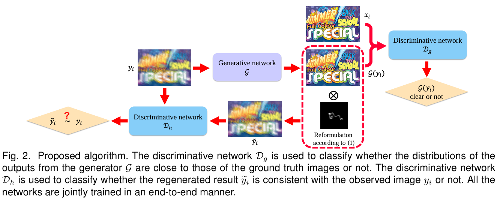

# Physics-Based Generative Adversarial Models for Image Restoration and Beyond


<p align="center">


This repository provides the official PyTorch implementation of the following paper:

> Physics-Based Generative Adversarial Models for Image Restoration and Beyond
>
> Jinshan Pan, Jiangxin Dong, Yang Liu, Jiawei Zhang, Jimmy Ren, Jinhui Tang, Yu-Wing Tai, Ming-Hsuan Yang
>
> In TPAMI 2020. 
>
> Paper: https://ieeexplore.ieee.org/document/8968618
>
> Abstract: We present an algorithm to directly solve numerous image restoration problems (e.g., image deblurring, image dehazing, and image deraining). These problems are ill-posed, and the common assumptions for existing methods are usually based on heuristic image priors. In this paper, we show that these problems can be solved by generative models with adversarial learning. However, a straightforward formulation based on a straightforward generative adversarial network (GAN) does not perform well in these tasks, and some structures of the estimated images are usually not preserved well. Motivated by an interesting observation that the estimated results should be consistent with the observed inputs under the physics models, we propose an algorithm that guides the estimation process of a specific task within the GAN framework. The proposed model is trained in an end-to-end fashion and can be applied to a variety of image restoration and low-level vision problems. Extensive experiments demonstrate that the proposed method performs favorably against state-of-the-art algorithms.
> 

---

## Contents

The contents of this repository are as follows:

1. [Dependencies](#Dependencies)
2. [Train](#Train)
3. [Test](#Test)


---

## Dependencies

- Python
- Pytorch (1.13)
- CUDA (11.7)


---

## Train

1. Train the model:
```
python train_text_deblur.py --dataroot ./datasets/text_deblurring --model cycle_gan_deblur --dataset_mode aligned_deblur --no_dropout --no_flip
```
2. Continue training (load the latest model) : 
```
python train_text_deblur.py --dataroot ./datasets/text_deblurring --model cycle_gan_deblur --dataset_mode aligned_deblur --no_dropout --no_flip --continue_train --which_epoch 200 --epoch_count 201
```


---

## Test

Test datasets are available at https://drive.google.com/drive/folders/1GCKyDK1V0g0-kFu9M3rzfdLxt1Th-BxJ

Output images will be saved in ``` ./results``` folder.
1. Image Deblurring:
```
python test_deblur.py
```
2. Image Dehazing:
```
python test_dehaze.py
```


---


